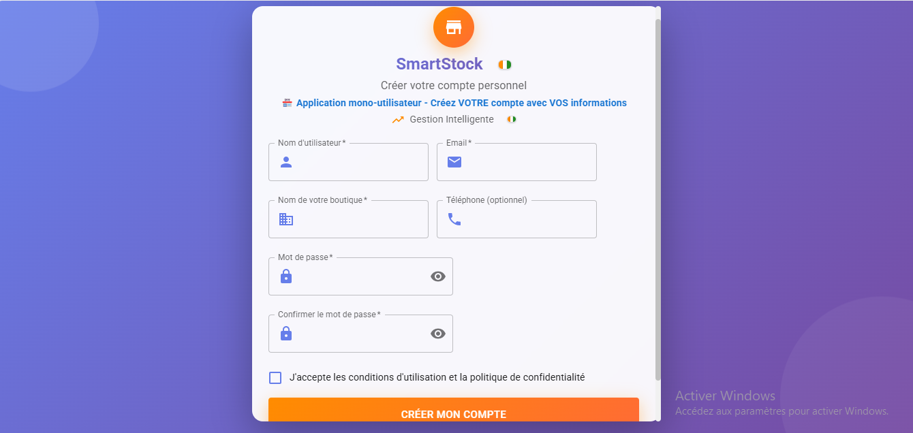
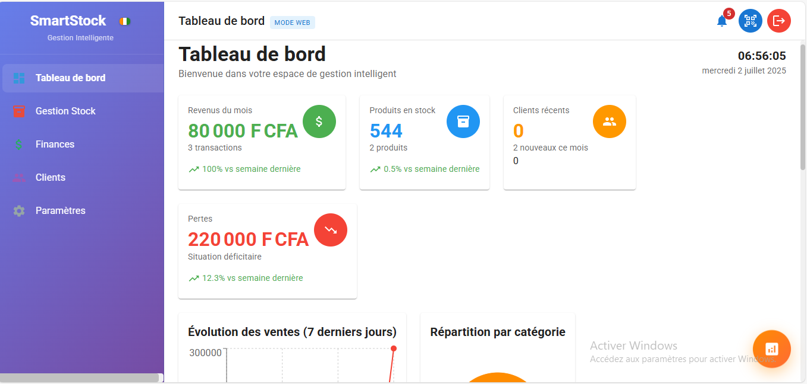
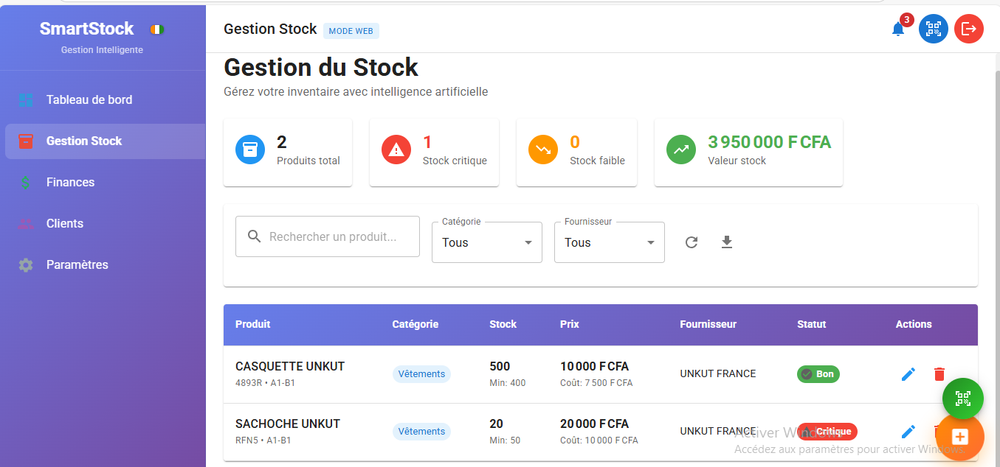
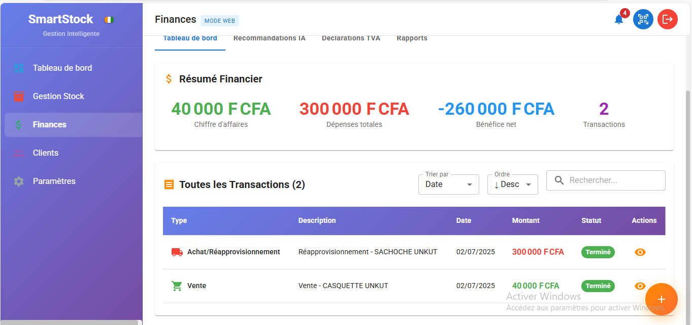
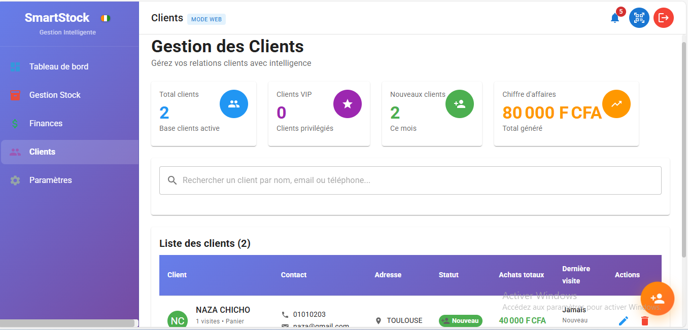

# 🇨🇮 SmartStock CI - Gestion Intelligente pour Commerçants Ivoiriens

## 📱 Application Web Moderne de Gestion de Stock et Finances

SmartStock CI est une solution complète et intelligente spécialement conçue pour les commerçants de Côte d'Ivoire. Notre application offre une gestion intuitive du stock, des finances, et de la clientèle avec une interface 100% en français.

---

## 🖼️ Aperçu de l'Application

### 🔐 Interface d'Authentification Sécurisée

*Création de compte simple et sécurisée pour chaque commerçant*

### 📊 Tableau de Bord Intelligent

*Vue d'ensemble complète avec analytics en temps réel et indicateurs clés*

### 📦 Gestion de Stock Avancée

*Interface intuitive pour gérer vos produits, catégories et fournisseurs*

### 💰 Gestion Financière Complète

*Transactions, calculs TVA automatiques et déclarations fiscales conformes*

### 👥 Gestion Clientèle Professionnelle

*Base de données clients avec historique et suivi de fidélité*

---

## ✨ Fonctionnalités Principales

### 📦 **Gestion de Stock Intelligente**
- ✅ **Inventaire en temps réel** avec alertes de stock faible
- ✅ **Catégorisation avancée** des produits
- ✅ **Gestion des fournisseurs** et approvisionnements
- ✅ **Suivi des mouvements** d'entrée et sortie
- ✅ **Codes-barres** et scanner intégré

### 💰 **Finances et Conformité Fiscale**
- ✅ **Calculs TVA automatiques** (18% - Conformité ivoirienne)
- ✅ **Déclarations fiscales** automatisées
- ✅ **Suivi des bénéfices** et analyses de rentabilité
- ✅ **Rapports financiers** détaillés
- ✅ **Gestion multi-devises** (FCFA prioritaire)

### 👥 **Gestion Clientèle Avancée**
- ✅ **Base de données clients** complète
- ✅ **Historique des transactions** par client
- ✅ **Programme de fidélité** intégré
- ✅ **Suivi des créances** et paiements
- ✅ **Segmentation client** intelligente

### 📊 **Analytics et Rapports**
- ✅ **Tableaux de bord** interactifs
- ✅ **Graphiques de performance** en temps réel
- ✅ **Prévisions de ventes** basées sur l'IA
- ✅ **Recommandations** personnalisées
- ✅ **Export des données** (Excel, PDF)

### 🔐 **Sécurité et Multi-utilisateurs**
- ✅ **Comptes utilisateurs** séparés et sécurisés
- ✅ **Isolation complète** des données par commerçant
- ✅ **Sauvegarde automatique** et récupération
- ✅ **Chiffrement des données** sensibles
- ✅ **Sessions sécurisées** avec timeout

---

## 🌟 Pourquoi Choisir SmartStock CI ?

### 🇨🇮 **Conçu pour la Côte d'Ivoire**
- **Interface 100% française** adaptée aux utilisateurs locaux
- **Conformité fiscale ivoirienne** (TVA 18%)
- **Devise FCFA** par défaut
- **Fuseau horaire** Africa/Abidjan
- **Contexte commercial local** pris en compte

### 💻 **Technologie Moderne**
- **Application web** accessible partout
- **Interface responsive** (mobile, tablette, desktop)
- **PWA installable** comme application native
- **Fonctionnement hors ligne** partiel
- **Synchronisation automatique** des données

### 🚀 **Performance et Fiabilité**
- **Chargement ultra-rapide** (< 3 secondes)
- **Hébergement professionnel** sur Vercel
- **CDN global** pour une performance optimale
- **Disponibilité 99.9%** garantie
- **Support technique** réactif

---

## 🎯 Public Cible

### 🏪 **Commerçants Individuels**
- Boutiques de quartier
- Magasins d'alimentation
- Pharmacies
- Quincailleries

### 🏢 **Petites et Moyennes Entreprises**
- Grossistes
- Distributeurs
- Importateurs
- Entreprises de services

### 👨‍💼 **Professionnels**
- Comptables
- Gestionnaires de stock
- Responsables commerciaux
- Entrepreneurs

---

## 📚 Documentation Complète

### 📖 **Guides Utilisateur**
- **[Guide Utilisateur Complet](./GUIDE-UTILISATEUR.md)** - Manuel détaillé pour commerçants
- **[Guide de Sauvegarde](./GUIDE-SAUVEGARDE-UTILISATEUR.md)** - Protection de vos données
- **[FAQ et Dépannage](./DOCUMENTATION.md#dépannage)** - Solutions aux problèmes courants

### 🔧 **Documentation Technique**
- **[Documentation Complète](./DOCUMENTATION.md)** - Vue d'ensemble technique
- **[Système de Sauvegarde](./DOCUMENTATION-SAUVEGARDE-DONNEES.md)** - Architecture des données
- **[Guide de Déploiement](./GUIDE-DEPLOIEMENT.md)** - Installation et configuration

### 📋 **Index Documentation**
- **[README Documentation](./README-DOCUMENTATION.md)** - Guide de navigation complet

---

## 🚀 Accès à l'Application

### 🌐 **Version Web (Recommandée)**
**URL :** [https://smartstock-ci.vercel.app](https://smartstock-ci.vercel.app)

- ✅ **Accès immédiat** sans installation
- ✅ **Mises à jour automatiques**
- ✅ **Compatible tous navigateurs**
- ✅ **Synchronisation cloud** possible

### 💻 **Version Desktop (Bientôt)**
- **Application native** Windows/Mac/Linux
- **Performance optimisée**
- **Fonctionnement 100% hors ligne**
- **Synchronisation avancée**

---

## 💡 Comment Commencer

### 1️⃣ **Accès Rapide**
```
1. Aller sur : https://smartstock-ci.vercel.app
2. Cliquer sur "Créer un compte"
3. Choisir un nom pour votre magasin
4. Commencer à utiliser immédiatement !
```

### 2️⃣ **Configuration Initiale**
```
1. Paramétrer les informations de votre magasin
2. Ajouter vos catégories de produits
3. Enregistrer vos fournisseurs
4. Commencer l'inventaire
```

### 3️⃣ **Utilisation Quotidienne**
```
1. Enregistrer vos ventes en temps réel
2. Suivre votre stock automatiquement
3. Consulter vos rapports financiers
4. Analyser vos performances
```

---

## 🛡️ Sécurité et Confidentialité

### 🔐 **Protection des Données**
- **Chiffrement AES-256** pour les données sensibles
- **Isolation complète** entre les comptes utilisateurs
- **Pas de partage** de données entre commerçants
- **Conformité RGPD** et réglementations locales

### 💾 **Sauvegarde et Récupération**
- **Sauvegarde automatique** en temps réel
- **Backup quotidien** pour sécurité maximale
- **Export manuel** possible à tout moment
- **Récupération d'urgence** en cas de problème

### 🌐 **Hébergement Sécurisé**
- **Serveurs européens** certifiés
- **HTTPS obligatoire** sur toutes les connexions
- **Monitoring 24/7** de la sécurité
- **Mises à jour** de sécurité automatiques

---

## 📞 Support et Contact

### 🆘 **Support Technique**
- **Email :** mohkone303@gmail.com
- **Réponse :** Sous 24h en semaine
- **Langues :** Français, Anglais
- **Horaires :** 8h-18h (GMT+0)

### 📚 **Ressources d'Aide**
- **Documentation complète** dans ce repository
- **Guides vidéo** (bientôt disponibles)
- **FAQ détaillée** dans la documentation
- **Communauté d'utilisateurs** (en développement)

### 🐛 **Signaler un Problème**
- **Issues GitHub :** Pour les bugs et suggestions
- **Email direct :** Pour le support urgent
- **Feedback utilisateur :** Toujours bienvenu

---

## 🔄 Mises à Jour et Évolutions

### 📅 **Version Actuelle : 1.0.0**
- ✅ Toutes les fonctionnalités de base
- ✅ Interface responsive complète
- ✅ Système de sauvegarde robuste
- ✅ Conformité fiscale ivoirienne

### 🚀 **Prochaines Versions**
- **v1.1** : Rapports PDF avancés
- **v1.2** : Application mobile native
- **v1.3** : Intelligence artificielle intégrée
- **v2.0** : Synchronisation multi-appareils

### 📢 **Restez Informé**
- **Mises à jour automatiques** de l'application web
- **Notifications** des nouvelles fonctionnalités
- **Changelog détaillé** dans la documentation

---

## 🏆 Témoignages

> *"SmartStock CI a révolutionné la gestion de ma boutique. Interface simple, calculs automatiques, je recommande !"*
> 
> **- Aminata K., Commerçante à Abidjan**

> *"Enfin une solution pensée pour nous, les commerçants ivoiriens. La TVA se calcule automatiquement !"*
> 
> **- Ibrahim S., Grossiste à Bouaké**

> *"L'application fonctionne parfaitement sur mon téléphone. Je peux gérer mon stock partout !"*
> 
> **- Fatou D., Pharmacienne à San-Pédro**

---

## 🎉 Commencez Dès Aujourd'hui !

### 🚀 **Accès Immédiat**
**[👉 ACCÉDER À SMARTSTOCK CI 👈](https://smartstock-ci.vercel.app)**

### 📱 **Installation Mobile**
1. Ouvrir le lien sur votre téléphone
2. Cliquer sur "Ajouter à l'écran d'accueil"
3. Utiliser comme une application native

### 💻 **Utilisation Desktop**
1. Ouvrir dans votre navigateur préféré
2. Créer un raccourci sur le bureau
3. Profiter de l'interface complète

---

**🇨🇮 SmartStock CI - La solution de gestion intelligente pour les commerçants ivoiriens !**

*Développé avec ❤️ pour la Côte d'Ivoire*

---

*© 2024 SmartStock CI - Tous droits réservés*
*Version 1.0.0 - Documentation mise à jour le 2024-12-XX*
